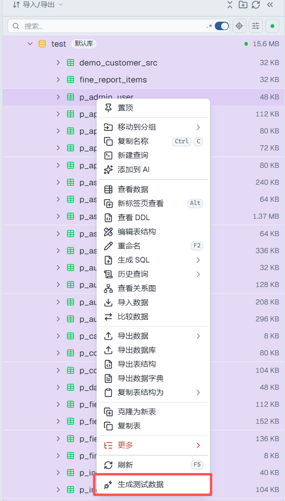
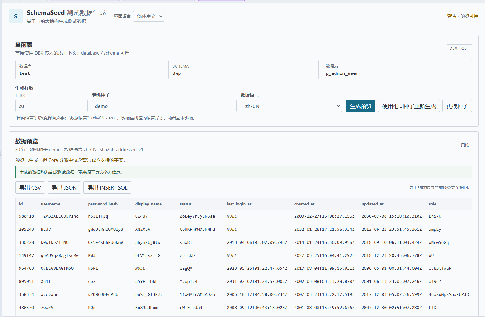

  

<h1 align="center">SchemaSeed</h1>

<strong>在 DBX 中按表结构生成测试数据，预览后导出。</strong>

  
  
  

SchemaSeed 是一个 DBX 测试数据生成插件。在数据库表上右键即可根据当前表结构生成测试数据，预览确认后可导出 CSV、JSON 或 INSERT SQL，用于开发、联调和功能验证。

## 界面预览

在 DBX 数据库树中右键目标表，选择「生成测试数据」即可打开 SchemaSeed。

工作台根据当前表结构生成数据，可先预览，再导出 CSV、JSON 或 INSERT SQL。

## 主要能力

- 根据当前表结构和字段类型生成测试数据，可设置生成行数（1–100）。
- 可设置随机种子和数据语言（简体中文或英文），工作台界面也支持简体中文和英文；还可按字段调整生成规则。
- 对同一张表，在表结构、生成规则、数据语言和随机种子均相同时可重复得到一致结果；更换随机种子即可得到另一组数据。
- 生成结果不会复制真实数据行。仅当字段适合判断时，Workbench 才可能通过 DBX Host API 对当前已打开连接做一次最多 8 行、仅候选列的只读样本探测；原始样本只在当前推断调用中用于计算安全 profile，不作为完整数据行来源。
- 支持预览并导出 CSV、JSON 和 INSERT SQL；导出内容与当前预览使用同一份数据。
- 可为单表设置显式生成约束，例如唯一值、组合唯一值和必填且唯一。

## 快速开始

1. 在 DBX「插件中心 → Marketplace」搜索并安装 SchemaSeed。
2. 在数据库树中找到目标表，右键选择「生成测试数据」。从插件中心单独打开时若没有表上下文，工作台会显示可见诊断；请从具体表的右键菜单进入。
3. 设置生成行数、随机种子和数据语言；需要时展开字段规则，调整具体字段的生成方式。
4. 点击「生成预览」，检查数据和提示信息。
5. 确认后导出 CSV、JSON 或 INSERT SQL。导出的是当前预览中的数据。

## 安装与运行要求

- **支持系统：**Windows、macOS 与 Linux 上运行的 DBX Desktop。SchemaSeed 是 DBX sandbox 内的前端插件，发布为官方 universal `.dbxp`，不包含平台专用运行二进制。
- **DBX：**`0.6.23` 或更高版本；表结构读取要求 Host API 1.3 `schemaMetadataApi` 和 `host.schema:read`。可选样本推断使用 Host API 1.4 Data API、`host.data:read` 及 DBX 按插件/连接管理的用户授权；Data API 不可用或未授权时按表结构 metadata-only 生成。
- **普通用户无需安装 Node.js/npm、修改 PATH 或执行命令。**Node.js 22+ 只用于开发和 CI 构建，不是插件安装包的运行依赖。
- **推荐安装：**从 DBX 插件中心的 Marketplace 搜索 SchemaSeed 安装。SchemaSeed 已上架 DBX Store；可查看[Store 目录条目](https://github.com/t8y2/dbx-store/blob/main/plugins/io.github.0verme.schema-seed.json)。
- **手动安装：**[GitHub Releases](https://github.com/0verme/dbx-plugin-SchemaSeed/releases/latest) 提供 `.dbxp` 包。Release 中的包是未签名开发候选包；如需在 DBX 中手动安装，需按 DBX 插件中心设置启用 `Allow unsigned development packages`。日常使用建议通过 Marketplace 安装已签名的 Store 版本。

## 适合这些场景

- 开发新功能时快速准备样例数据。
- 前后端或数据接口联调。
- 准备功能验证、演示和回归测试数据。
- 导出 INSERT SQL，在其他测试环境中检查或使用。

## 安全与当前限制

- SchemaSeed 只通过 DBX Host API 读取当前表结构；当存在适合探测的字段时，还可能通过 `host.data:read` 对同一已打开连接读取最多 8 行、候选字段的只读样本。首次按插件/连接授权由 DBX Host consent 管理；拒绝或不可用时退回 metadata-only，不影响生成。
- 敏感字段不等于完全不采样：敏感原始值仅在当前 inference 调用的内存中短暂使用以计算安全 profile，不展示、不持久化；原始敏感值不进入 GenerationPlan、日志、持久化存储、外部服务或 AI/LLM。采样只用于提取码值、分布、范围、格式等安全特征。仅通过隐私 guard 的短类别标签会按观察频率进入 synthetic preview/export，numeric 只用于安全范围/零频次、文件名只复用后缀并使用合成 stem。采样不会改变 schema metadata。SchemaSeed 不读取数据库凭据、不创建第二连接、不执行写 SQL 或 DDL。
- 生成、预览和导出不会写入数据库；导出的 INSERT SQL 只是文本，不会自动执行。
- 当前围绕单张表生成数据，不支持自动发现数据库的 PK、FK、CHECK、Identity 等约束，也不支持多表关联生成。工作台中的手动生成约束仅约束 SchemaSeed 生成的数据，不代表已读取数据库中的真实约束。
- INSERT SQL 使用通用写法，不会针对所有数据库方言自动适配；执行前请在目标数据库中核对。复杂字段或业务规则可能需要手动调整生成规则。

## 开发与文档

- [Roadmap](docs/ROADMAP.md)
- [Generation Model](docs/GENERATION_MODEL.md)
- [Column Generation Rules](docs/COLUMN_GENERATION_RULES.md)
- [Manual Constraints](docs/MANUAL_CONSTRAINTS.md)
- [Workbench i18n](docs/I18N.md)
- [Production Workbench](docs/PHASE1E_PRODUCTION_WORKBENCH.md)
- [Host API Audit](docs/HOST_API_AUDIT.md)
- [Node-free 生产运行时架构审计](docs/NODE_FREE_RUNTIME.md)
- [轻量只读样本探测](docs/LIGHTWEIGHT_DATA_SAMPLING.md)
- [DBX 插件开发文档](https://dbxio.com/en/docs/plugin-development)
- [更多开发文档](docs/)

本地 fixture Workbench 可用 `npm run workbench` 启动，它使用仓库中的示例表结构，不连接 DBX。开发和构建需要 Node.js（22+）及 `npm ci` 安装的 DBX 官方 CLI；这不是生产插件的运行依赖。常用检查命令：`npm test`、`npm run lint`、`npm run typecheck`、`npm run build`、`npm run smoke:package-identity`。

## License

[Apache-2.0](LICENSE)
